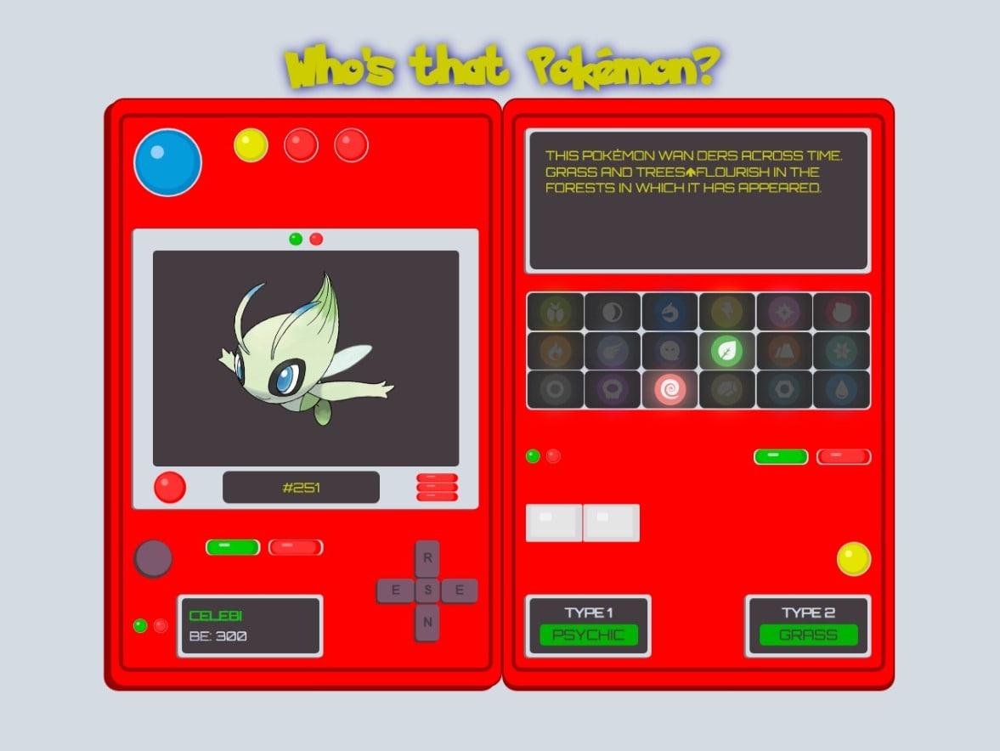

# Who's that Pokémon?

Videojuego web donde pondrás a prueba tus conocimientos sobre la serie de anime Pokémon.

Adivina el nombre del Pokémon solo por su silueta y desbloquea sus características  
como el tipo y la descripción.

Explora las evoluciones del Pokémon.

## Prerrequisitos

≧◠‿◠≦

1. Conocimietos sobre la serie de anime Pókemon.
2. Utiliza el código Konami "wwssadadba" si no sabes el nombre del Pókemon.

## Instalación

≧◠‿◠≦

1. Clona el repositorio `git clone https://github.com/miniscandal/whos-that-pokemon`  
   en tu computadora.
2. Abre una terminal en la carpeta del proyecto.
3. Ejecuta el comando `npm install` para instalar las dependencias del proyecto.
4. Ejecuta el comando `npm run dev` para iniciar la aplicación.

## Uso

≧◠‿◠≦

## Tecnologías

  

## Aprendizajes

≧◠‿◠≦

Mientras trabajaba en esta aplicación web, tuve la oportunidad de perfeccionar  
mis habilidades para crear una aplicación más eficiente y fácil de mantener.

La implementación de la metodología de diseño atómico, junto con la componentización y la  
separación de la lógica de negocio de la interfaz de usuario, mejoró significativamente  
la estructura, el mantenimiento y la organización de mi código.

## Documentación

≧◠‿◠≦

* [React](https://react.dev/)
* [Vite](https://vitejs.dev/)
* [Pokéapi](https://pokeapi.co/docs/v2)

## Licencia

≧◠‿◠≦

Este proyecto está bajo la Licencia MIT - mira el archivo LICENSE para detalles.