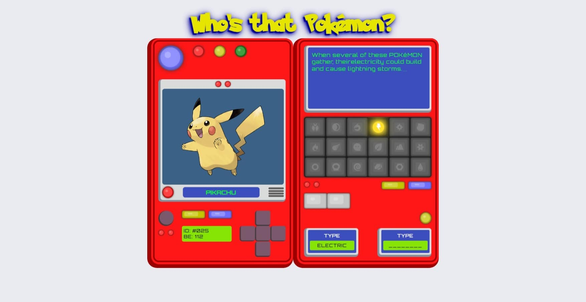
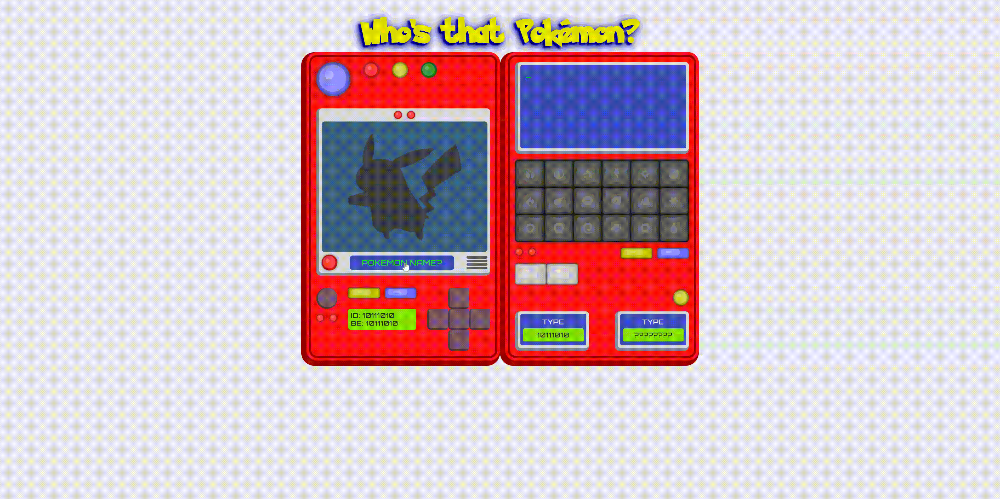

# Who's that Pokémon?

"Who's that Pokémon?" es un videojuego que te reta a identificar tu Pokémon favorito.

Adivinar el nombre desbloqueara informacion del Pokémon.

¡Prepárate para poner a prueba tus conocimientos y aprender más sobre el fascinante mundo Pokémon!




## Configuración de desarrollo
 ≧◠‿◠≦

### Requisitos previos

* Install [Node.js](https://nodejs.org/es) which includes [Node Package Manager](https://docs.npmjs.com)

### Instalación

Clone the repository:

```
git clone https://github.com/miniscandal/whos-that-pokemon.git
cd .\whos-that-pokemon\
```

Install project dependencies:

```
npm install
```

Run application:

```
npm run dev
```

### Demostración

≧◠‿◠≦




#### Elementos Secretos

Si no conoces el nombre del Pokémon, puedes usar el código Konami "wwssadadba".


## Documentación 
 ≧◠‿◠≦


### Tecnologías avanzadas

* [React](https://react.dev/)
* [Vite](https://vitejs.dev/)
* [Pokéapi](https://pokeapi.co/docs/v2)


### Tecnologías utilizadas
 ≧◠‿◠≦


  


## Reflexiones y Aprendizajes

≧◠‿◠≦

Durante el desarrollo de esta aplicación web, tuve la oportunidad de perfeccionar y expandir
mis habilidades en varias áreas clave.

Implementé el método de diseño atómico, lo que me permitió crear componentes
reutilizables y mantener una interfaz de usuario coherente.
La componentización facilitó la mantenibilidad y la escalabilidad del proyecto.

Trabajé para mejorar significativamente la estructura del proyecto, lógica de
negocio y las funcionalidades, lo que aumentó la organización del código y facilitó la
navegación y la comprensión del flujo del programa.

Tuve la oportunidad de trabajar con JavaScript moderno, lo que incluyó el manejo de APIs y la
implementación de un sistema de caché para prevenir solicitudes redundantes.
Además, me encargué de la importación y exportación de módulos para optimizar la
organización y reutilización del código, así como del manejo de errores.

En el diseño de la aplicación, implementé diversas características de CSS.
Entre ellas, utilicé selectores de atributos de datos y consultas de medios (media queries) para
garantizar una adaptación eficaz.
Este enfoque resultó en un diseño responsivo que mejora la experiencia del
usuario.

A pesar de los logros alcanzados durante el desarrollo de esta aplicación web, reconozco
que hay áreas de mejora. Una de ellas es la implementación y mejora de las pruebas
automáticas de este software. Aunque he realizado pruebas manuales, entiendo la importancia
de las pruebas automáticas para garantizar la calidad del código y facilitar futuras actualizaciones.
Esta es una crítica constructiva que planeo abordar en mis futuros proyectos.

En resumen, este proyecto no solo me permitió profundizar en mis habilidades existentes, sino
también adquirir nuevas competencias, todas ellas fundamentales para el desarrollo web moderno.
Estoy emocionado por cómo estas habilidades me permitirán enfrentar futuros desafíos de desarrollo.


## Creditos
≧◠‿◠≦

* [Pokéapi](https://pokeapi.co/docs/v2)


## Licencia

≧◠‿◠≦

Este proyecto está bajo la licencia MIT. Consulta el archivo LICENSE para más detalles.
